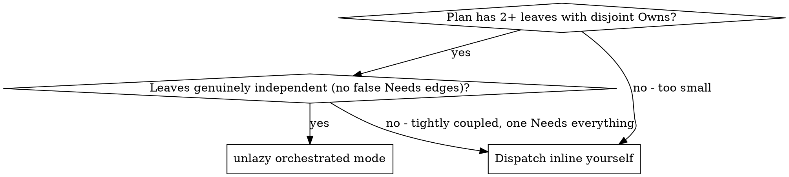

# Unlazy

## Overview

Orchestrated mode runs a plan built from **leaves** — tasks that each own a
disjoint set of files (see `templates/PLAN.md`) — by dispatching them to
subagents and verifying each one against a **gate** (see
`references/gates.md`) before anything downstream of it may start. Because
leaves own disjoint files, leaves with no dependency on each other are safe
to run at the same time; the driver loop in `references/orchestration.md`
does exactly that — rolling dispatch instead of one-leaf-at-a-time lockstep.

**Core principle:** leaves whose `Needs` are already satisfied run
concurrently; each leaf's gate checks only that leaf; whole-project checks
live in branch gates and run once, at the end — never once per leaf.

## When to Use



A handful of one-file leaves, or leaves that aren't really independent (one
`Needs` almost everything downstream), don't need this — dispatch them
yourself inline. That's the same call model-router makes for a small task:
route through it, and expect it to bail out and tell you to just do the
work directly rather than fan out subagents for five edits.

## Files in this skill

- `templates/PLAN.md` — the plan shape: leaves with `Owns`/`Needs`/`Tier`,
  branch gates, and a dispatch log. Copy this when writing a new plan for
  orchestrated mode.
- `references/orchestration.md` — the driver loop: rolling dispatch, scoped
  verification, the per-leaf fix loop, and model selection for `Tier`.
- `references/gates.md` — the gate file format `gate-check.mjs` reads: leaf
  vs. branch gates, shared checks via `USE:`, exit codes, and stop-hook
  wiring.
- `gate-check.mjs` — zero-dependency Node script that runs a gate file's
  (or several gate files') `CHECK` commands and reports PASS/FAIL. See
  `references/gates.md` for its full CLI and exit-code contract.

## Quick Start

1. Write the plan from `templates/PLAN.md`: one leaf per disjoint unit of
   work, `Owns`/`Needs`/`Tier` filled in, a gate file per leaf under
   `gates/`, branch-wide checks pulled out into `gates/_branch.md`.
2. Read `references/orchestration.md` and run its driver loop: seed the
   ready set, dispatch every ready leaf at once, verify each on return
   with a scoped `gate-check.mjs` call, roll whatever it unblocks straight
   back into dispatch.
3. When every leaf is done-and-gated, run `node gate-check.mjs
   gates/_branch.md` once for the whole-project checks.

```sh
# Per leaf, right after its dispatch returns:
node .claude/skills/unlazy/gate-check.mjs gates/<leaf-id>.md

# Once, after every leaf is done:
node .claude/skills/unlazy/gate-check.mjs gates/_branch.md
```
