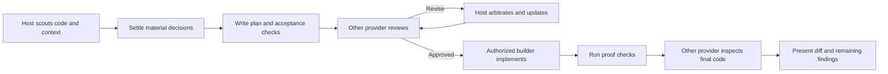

<div align="center">


### Skills for working across Claude Code and Codex.

[](https://github.com/chaseai-yt/claudex-loop/stargazers)
[](./LICENSE)
</div>

This repository contains separate skills for choosing a model, making a one-off handoff, and running a complete development workflow. They share a repository and plugin distribution; **Claudex Route is independent of the Claudex Loop workflow**.

| Skill | Use it for | Dependencies |
|---|---|---|
| [`claudex-route`](skills/claudex-route/SKILL.md) | A model recommendation or one scoped handoff | Self-contained; selected CLI needed only for delegation |
| [`claudex-loop`](skills/claudex-loop/SKILL.md) | Requirements, plan review, implementation, and final inspection | Both CLIs and Python 3.10+ |
| [`codex-review`](skills/codex-review/SKILL.md) | Explicit Codex plan-review compatibility command | Shared `claudex-loop` skill |
| [`codex-build`](skills/codex-build/SKILL.md) | Explicit Codex builder compatibility command | Shared `claudex-loop` skill |

## Claudex Loop

Claudex Loop gives a plan an independent review before implementation, then gives the code an independent inspection. Your current conversation handles requirements and coordination; the other provider challenges the plan with concrete evidence. The host arbitrates findings, records decisions, and keeps the loop bounded.

| Start here | Requirements and plan | Plan review | Default build | Final inspection |
|---|---|---|---|---|
| **Claude Code** | Current Claude session | Codex | Claude | Fresh Codex session |
| **Codex** | Current Codex session | Claude | Codex | Fresh Claude session |

Choose either builder with `builder=claude` or `builder=codex`. The inspector follows the builder choice and always uses the other provider. If the coordinator takes over fixes, those new edits need another independent inspection. With mixed authorship, the log records who wrote and reviewed each part.

Model choices remain configurable. Use **Claude Fable 5.1** and **GPT-6 Astra** when selected and available on your accounts, or retain each CLI's configured model. The host UI selection does not automatically change the other CLI's configuration. Requested and observed model information is recorded separately, and there is no silent model/provider fallback.

## Claudex Route: standalone task routing

Use [`claudex-route`](skills/claudex-route/SKILL.md) when you want help choosing who should handle a task. It recommends a model and a role with a short reason: stay with the current agent, get a second opinion on a plan or implementation, investigate a blocker, or delegate a bounded task. It can perform one handoff when requested. Recommendations alone do not launch another model or authorize edits.

```text
claudex-route: Who should handle this CSV import feature? Prioritize cost.
claudex-route: Recommend a second opinion on this plan before we build.
claudex-route: Pick a suitable model and have it diagnose this failing test read-only.
```

For example, Luna may suit a focused fixture-generation task, Terra a bounded implementation, and Astra or Fable a difficult review. These are task-fit recommendations, not a fixed ranking; available models, context, verification, and current pricing matter. Staying with your current model is a valid result. Route is a self-contained instruction skill with no Python dependency; a delegated run requires the selected CLI and account access. It does not use the full loop's approval-binding runner.

Claudex Route runs independently. Use **Claudex Loop** when you want repeated plan review, implementation, and independent inspection.

## The Claudex Loop workflow



1. **Recon:** inspect existing code and relevant docs, or research greenfield assumptions. Present an assumptions ledger with sources.
2. **Requirements:** resolve decisions that change the outcome. Batch independent questions, preserve user intent, and write a plan with observable acceptance criteria and proof commands.
3. **Plan review:** the other provider reads the plan and relevant code, returns evidence-backed findings, and revisits revisions in the same session. Stop at the round budget or an explicit verdict: `APPROVED`, `REVISE`, or `BLOCKED`.
4. **Build and inspect:** once implementation is authorized, the selected builder works from the plan. Independently run proof checks and inspect the final changes with the other provider in a fresh session.

The user controls consequential decisions and authorization. A request to review a plan does not authorize implementation. A request to plan and implement does not need redundant build approval. Commits, pushes and publication follow the user's existing instructions.

`PLAN.md` records what to build; `PLAN-REVIEW-LOG.md` records the findings, dispositions, models, proof and remaining uncertainty. Both paths are configurable. Detailed CLI diagnostics live in a unique directory outside the target checkout.

## Install

Both CLIs must be installed and authenticated for the full cross-provider workflow. Python **3.10+** runs the shared adapter; no runtime pip packages or separate API keys are required. Check `codex --version`, `codex login status`, `claude --version` and `claude auth status`. See the [runtime reference](skills/claudex-loop/references/runtime.md) for tested CLI versions and permission boundaries.

### Claude Code plugin

```text
/plugin marketplace add chaseai-yt/claudex-loop
/plugin install claudex-loop@claudex-loop
```

Use `/claudex-loop:claudex-route` for a lightweight recommendation or one-off handoff, or `/claudex-loop:claudex-loop`, `/claudex-loop:codex-review`, or `/claudex-loop:codex-build` for the existing workflows. Enable marketplace auto-update in the plugin menu if desired.

### Codex or manual skill installation

Clone this repository and copy all skill directories together. The compatibility commands share the runtime inside `claudex-loop`; copying an alias alone is insufficient. `claudex-route` can also be installed on its own.

To install **only Claudex Route**, copy `skills/claudex-route/` into `~/.agents/skills/` for Codex or `~/.claude/skills/` for Claude Code. No other skill from this repository is required. The commands below install the complete collection into both hosts.

```bash
# macOS / Linux — run from this repository
mkdir -p ~/.agents/skills ~/.claude/skills
cp -R skills/. ~/.agents/skills/
cp -R skills/. ~/.claude/skills/
```

```powershell
# Windows PowerShell — run from this repository
New-Item -ItemType Directory -Force "$env:USERPROFILE\.agents\skills", "$env:USERPROFILE\.claude\skills" | Out-Null
Copy-Item -Recurse -Force skills\* "$env:USERPROFILE\.agents\skills\"
Copy-Item -Recurse -Force skills\* "$env:USERPROFILE\.claude\skills\"
```

Open a new session to pick up the skills. In Codex, invoke `$claudex-route` for routing, or `$claudex-loop` for the full workflow. In Claude Code, invoke `/claudex-route` or `/claudex-loop` after manual installation. Updates are `git pull` and re-copy. A `.codex-plugin/plugin.json` is also supplied for Codex plugin packaging; manual skill installation does not require adding a marketplace.

### Examples

```text
claudex this feature — plan and implement it
claudex this plan, mode=review, plan=docs/migration.md, rounds=3
claudex this feature, builder=codex, reviewer_model=gpt-6-astra
claudex this feature, builder=claude, reviewer_model=claude-fable-5-1
```

The third example starts in Claude Code; the fourth starts in Codex. The host selects the opposite reviewer automatically. `codex-review` remains an explicit Codex review command; `codex-build` remains an explicit Codex builder command. For automatic host-based routing, use `claudex-loop`.

## Controls

| Argument | Default | Purpose |
|---|---|---|
| `mode` | `full` | `review` starts from an existing plan |
| `plan` / `PLAN_FILE` | `PLAN.md` | Plan path, carried through every phase |
| `log` / `LOG_FILE` | `PLAN-REVIEW-LOG.md` | Append-only decision log |
| `builder` | current host | `claude` or `codex` |
| `reviewer_model`, `builder_model`, `inspector_model` | each CLI's configuration | Explicit per-role model override |
| `reviewer_effort`, `builder_effort`, `inspector_effort` | each CLI's configuration | Explicit supported reasoning effort |
| `rounds` / `MAX_ROUNDS` | `5` | Completed plan-review round cap |
| `MAX_FIX_ROUNDS` | `2` | Build-fix attempt cap |
| `MAX_INSPECTION_ROUNDS` | `2` | Initial inspection plus one reinspection |
| `research` | proportionate to task | `none`, `web`, or explicitly authorized `deep` |
| `inspect` | `on` | `off` is an explicit, logged opt-out |
| `PROOF_CMD` | from plan/repo | Agreed command that verifies the deliverable |

## What an approval means

The runner validates a successful CLI turn and a structured review; an empty output file or a session-start event cannot count as approval. The approval records the plan's path and SHA256. Changing the plan invalidates it. Inspections also record the pre-build commit and a fingerprint of the inspected changes, including staged and untracked files. Later code changes need another inspection.

A clean structured result does not prove the model is right. The log preserves coverage, limitations and concrete evidence. Zero findings is valid; a large number of findings is not a quality score. `BLOCKED`, execution failures and exhausted round budgets are surfaced rather than converted to approval.

Codex reviews use the read-only shell sandbox. Claude reviews expose only file reading/search, with customizations disabled and no MCP tools. These boundaries differ: see [runtime details](skills/claudex-loop/references/runtime.md), especially existing Codex MCP configuration. Builders use bounded permissions, and delegated builds require a clean checkout. A worktree preserves unrelated work; it is not itself a security sandbox.

## Development and verification

```text
python -m pip install -r requirements-dev.txt
python scripts/validate.py
python -m unittest discover -s tests -v
```

CI runs on Windows, macOS and Linux. Tests cover host routing, both result formats, resumed-session identity, malformed/empty/failed responses, timeout handling, approval invalidation, complete change manifests, and build resumption. Tests use disposable Git repositories and fake CLI processes, without model quota. Live CLI smoke-test results are recorded in [VALIDATION.md](VALIDATION.md).

## History and credits

This repository was previously `grill-me-codex` and `crucible`; GitHub redirects still work. The original skills remain in [legacy/](legacy/). The first reported end-to-end CRM planning run produced 55 findings over five rounds; it is an illustrative run, not a controlled benchmark of model pairings. The next step for measured defaults is comparing single-provider and cross-provider runs on the same acceptance tasks.

- Legacy interview skills: © [Matt Pocock](https://github.com/mattpocock/skills), MIT; see their third-party notices.
- Codex-as-builder pattern adapted from [Peter Steinberger](https://github.com/steipete/agent-scripts).
- Claudex Loop, cross-model review and packaging: [Chase AI](https://youtube.com/@chaseai).

Community reports and proposed fixes from [@darian033](https://github.com/darian033), [@ujconsulting](https://github.com/ujconsulting), [@mraol08831](https://github.com/mraol08831), and [@Dwodgaming](https://github.com/Dwodgaming) informed the bidirectional update. [@tura-ai-agent](https://github.com/tura-ai-agent) contributed the pending Chinese/Japanese translations. See [community acknowledgments and PR reconciliation](ACKNOWLEDGMENTS.md) for what was incorporated, adapted, or remains open.

[Claude Code Masterclass and Chase AI+](https://www.skool.com/chase-ai/about) · [MIT license](LICENSE)
